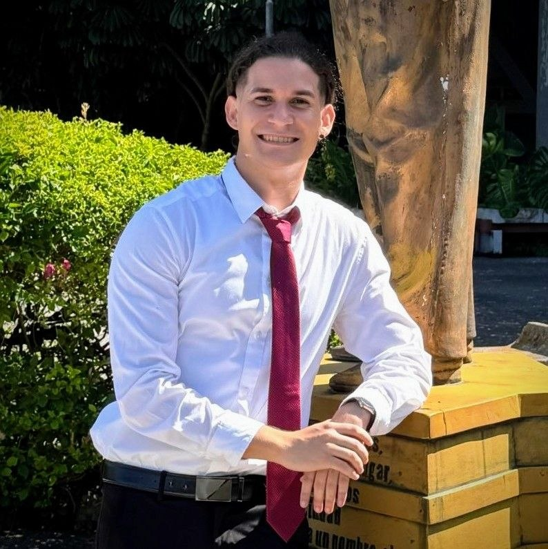

<div align="center">



<br/>

[](https://git.io/typing-svg)

<p>
  
  
</p>

</div>

<br/>

## 👨‍💻 About Me

> Mobile-first Software Engineer (**CUJAE, 2026**) specialized in **RAG architectures**, **backend development with FastAPI**, and **cross-platform apps with Flutter**. Certified in AI Excellence (**CUJAE 2026**). Co-founder of **Devisi**, international competitor in hackathons and competitive programming (*Top 37 Caribbean — ICPC*), and passionate about teaching people to code.

<table>
<tr>
<td width="50%" valign="top">

**🔭 Currently working on**
AI solutions with RAG architectures and mobile apps with Flutter

**🌱 Currently learning**
Scalable architectures for conversational AI systems

**🤝 Open to collaborate on**
Mobile development, applied AI and open source projects

**⚡ Fun fact**
I combine engineering with teaching — programming mentor at CUJAE

</td>
<td width="50%" valign="top">

```yaml
Name: Andy Clemente Gago
Role: Software Engineer
Stack: Python · Flutter · TypeScript
Focus: AI · Mobile · Backend · Design
Languages: Spanish (native) · English (A2)
Location: La Habana, Cuba 🇨🇺
```

</td>
</tr>
</table>

<br/>

## 🏆 Awards & Distinctions

<div align="center">


<br/>


<br/>


</div>

<br/>

## 🚀 Professional Experience

<table>
<tr>
<td width="100%">

### 🧩 Co-founder — <b>Devisi</b>
<sub>Aug 2025 — Present</sub>
Running my own software development venture, building custom digital products for clients from concept to deployment.

</td>
</tr>
<tr>
<td width="100%">

### 🤖 Programmer Technician — <b>ETI, BioCubaFarma</b>
<sub>Feb 2025 — Jun 2026 · La Habana, Cuba</sub>
Led the development of a unified platform to manage multiple virtual assistants using a **RAG (Retrieval-Augmented Generation)** approach. Built a FastAPI system with JWT authentication, document processing (PDF/DOCX), ChromaDB-based semantic search, an LLM-powered RAG engine, and Whisper audio processing. Represented ETI as a delegate at **SIGESTIC 2025**, a national research/industry event.

</td>
</tr>
<tr>
<td width="100%">

### 🌐 WordPress Developer — <b>By ONTOP</b>
<sub>Apr 2026 — Jun 2026 · Florida, USA (Remote)</sub>
Developed and maintained responsive WordPress websites for clients, along with social media content to support their marketing efforts.

</td>
</tr>
<tr>
<td width="100%">

### 👨‍🏫 Teaching Assistant — <b>CUJAE</b>
<sub>Mar 2025 — Mar 2026 · La Habana, Cuba</sub>
Lead instructor for practical classes in **Introduction to Programming** (C) and **Object-Oriented Design and Programming** (Java) for first- and second-semester Computer Engineering students.

</td>
</tr>
<tr>
<td width="100%">

### 📱 Mobile Developer — <b>Medialytic</b>
<sub>Nov 2024 — Jun 2025 · La Habana, Cuba</sub>
Completed a 3-month Flutter training program (Dart, Widgets, Provider state management, REST API integration) and built **"El Chismoso,"** an app that lets users capture and enrich photos with metadata such as GPS location and description.

</td>
</tr>
</table>

<br/>

## 🛠️ Tech Stack

<div align="center">

**Programming Languages**
<br/>


**Mobile Development**
<br/>


**Frontend**
<br/>


**AI & Backend**
<br/>
    

**Databases**
<br/>
 

**Tools & Design**
<br/>
  

</div>

<br/>

## 📂 Featured Projects

<table>
<tr>
<td width="33%" valign="top">

### 🔥 [Fogata Releases](https://github.com/AndyCG03/fogata-releases)
Official downloads repository for **Fogata**, a gaming platform. Manages versions and releases of the project.

`Game Distribution` `Releases`

</td>
<td width="33%" valign="top">

### 🏊 [Piscina La Elisa](https://github.com/AndyCG03/piscina_elisa)
Official website for Piscina La Elisa, with a responsive design focused on service promotion and booking.

`JavaScript` `Web`

</td>
<td width="33%" valign="top">

### 🤖 [AI API Service](https://github.com/AndyCG03/ai-api-service)
REST API built with FastAPI for local AI services: text generation, audio transcription, embeddings and OCR — fully local, no cloud dependency.

`FastAPI` `Python` `Local AI`

</td>
</tr>
<tr>
<td width="33%" valign="top">

### 🛒 [Devisistore](https://github.com/AndyCG03/devisistore)
Multi-user digital catalog platform with role-based access and session authentication, deployed live on Hostinger.

`Node.js` `Express` `SQLite`

</td>
<td width="33%" valign="top">

### 💱 [AIToque](https://github.com/AndyCG03/al_toque_app)
Currency exchange app with real-time rates, a multi-currency calculator, an Android widget and offline support.

`Flutter` `Dart`

</td>
<td width="33%" valign="top">

### 🧠 [Assists (Thesis)](https://github.com/AndyCG03/Trabajo_de_diploma-Andy_Clemente)
RAG-based platform for managing virtual assistants with local LLM execution, semantic search and role-based access control.

`FastAPI` `Vue 3` `PostgreSQL` `ChromaDB` `LLM`

</td>
</tr>
</table>

<div align="center">

[](https://github.com/AndyCG03?tab=repositories&language=dart)
[](https://github.com/AndyCG03?tab=repositories&language=python)
[](https://github.com/AndyCG03?tab=repositories&language=javascript)
[](https://github.com/AndyCG03?tab=repositories)

</div>

<br/>

## 📊 GitHub Streak

<div align="center">


</div>

<br/>

## 🌐 Connect With Me

<div align="center">

[](https://andydev.devisisoft.com)
[](https://www.linkedin.com/in/andy-clemente-gago-7590362a4)
[](https://instagram.com/ing.andyclemente)
[](https://x.com/AndyClemente6)
[](mailto:ing.andyclemente@gmail.com)

</div>


